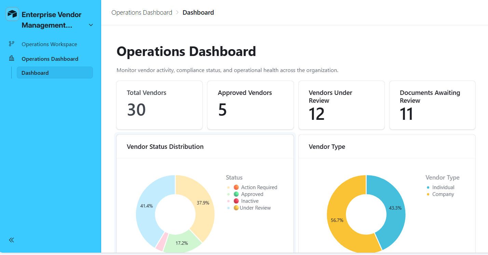
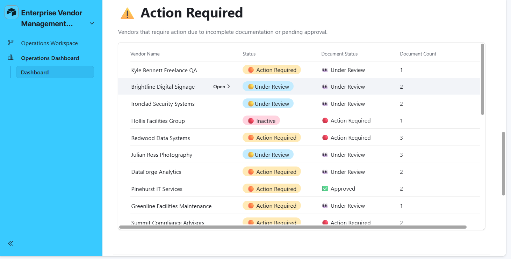

# Enterprise Vendor Management Platform

An Airtable-based vendor operations and compliance management system designed to centralize vendor onboarding, document tracking, compliance review, expiration monitoring, operational follow-up, and management reporting.

The platform demonstrates how Airtable can be used as an operational system rather than simply a spreadsheet or database. It combines relational data modeling, workflow automation, business rules, forms, exception management, and dashboards into a connected vendor lifecycle workflow.

---

## Business Problem

Vendor management often involves information spread across spreadsheets, email threads, shared folders, and disconnected systems.

This creates several operational problems:

- Vendor information must be entered and maintained manually
- Required documents may be missing or overlooked
- Compliance documents can expire without timely follow-up
- Operations teams have limited visibility into vendor readiness
- Review tasks are difficult to prioritize
- Vendor and document statuses can become inconsistent
- Manual follow-up increases administrative workload

The goal of this project was to design a centralized system that allows operations teams to manage the vendor lifecycle from initial intake through document collection, compliance review, approval, expiration monitoring, and operational follow-up.

---

## Solution Overview

The Enterprise Vendor Management Platform centralizes vendor information and connects it with contacts, compliance documents, and operational tasks.

The system supports:

- Vendor intake and onboarding
- Vendor classification
- Contact management
- Required-document generation
- W-9-driven onboarding workflows
- Document review and approval
- Document expiration monitoring
- Exception and action management
- Automated task creation and closure
- Vendor status monitoring
- Operational dashboards and reporting
- Duplicate-prevention controls

The platform is built around four connected tables:

**Vendors → Contacts → Documents → Action Queue**

Airtable Forms and Interfaces provide simplified entry points and operational views while the underlying relational tables maintain the system of record.

---

## System Architecture

### Vendors

The Vendors table serves as the central vendor record.

It stores and summarizes information such as:

- Vendor name
- Vendor type
- Vendor lifecycle status
- Associated contacts
- Associated documents
- Open operational tasks
- Document counts
- Compliance indicators

Vendor-level rollups and formulas summarize activity from related records so operations teams can quickly identify vendors requiring attention.

### Contacts

The Contacts table stores individuals associated with each vendor.

Typical information includes:

- First name
- Last name
- Email
- Phone
- Vendor relationship

Contacts are linked back to the appropriate vendor record.

### Documents

The Documents table manages vendor onboarding and compliance documentation.

Examples include:

- W-9
- Business License
- Insurance Certificate
- Master Service Agreement
- NDA

Each document can track:

- Vendor
- Document type
- Required status
- Review status
- Uploaded date
- Expiration date
- Approval state
- Related operational tasks

The document lifecycle includes statuses such as:

**Requested → Under Review → Approved / Rejected → Expired**

### Action Queue

The Action Queue provides an operational worklist for items requiring follow-up.

Tasks are linked to the relevant vendor and document and can include:

- Missing required documents
- Expired compliance documents
- Documents requiring follow-up
- Vendor documentation exceptions

Each task can track:

- Task description
- Vendor
- Document
- Status
- Priority
- Open-task indicator

This creates a centralized exception-management workflow instead of requiring operations teams to manually search through document records.

---

## Relational Data Model

The system uses linked records rather than duplicating information across tables.

```text
VENDORS
   │
   ├──────── CONTACTS
   │
   └──────── DOCUMENTS
                  │
                  └──────── ACTION QUEUE
```

This structure allows the system to answer operational questions such as:

- Which documents belong to this vendor?
- Which required documents are still outstanding?
- Which vendors currently have documents under review?
- Which documents have expired?
- Which vendors have unresolved operational tasks?
- Which action item belongs to which document?
- Has an issue already been resolved?

---

## Vendor Onboarding Workflow

The onboarding process begins with a vendor intake form.

The form captures core vendor and contact information, including:

- Vendor name
- Vendor type
- Contact first name
- Contact last name
- Website
- Contact phone
- Contact email

The submitted information is used to create and connect the appropriate vendor and contact records.

The onboarding workflow then begins document collection with the required W-9.

```text
Vendor Intake Form
        ↓
Vendor + Contact Created
        ↓
W-9 Requested
        ↓
W-9 Review
        ↓
W-9 Approved
        ↓
Remaining Required Documents Created
```

---

## W-9 Driven Document Workflow

The W-9 acts as an onboarding checkpoint.

Once the W-9 reaches **Approved** status, the system automatically creates additional required document records for the vendor.

These include:

- Business License
- Insurance Certificate
- Master Service Agreement

The generated records begin with a status of **Requested**, allowing the operations team to immediately identify which documents still need to be collected.

---

## Duplicate Prevention & Automation Idempotency

A key workflow challenge was preventing duplicate required-document records.

Initially, approving a W-9 correctly generated the downstream documents. However, if the W-9 status was later changed and returned to Approved, the automation could trigger again and create duplicate records.

To make the workflow idempotent, the Documents table includes a persistent control field:

**Post-W9 Documents Created?**

The automation checks this field before generating downstream documents.

```text
W-9 Approved
      ↓
Post-W9 Documents Created? = No
      ↓
Create Required Documents
      ↓
Set Post-W9 Documents Created? = Yes
      ↓
Future W-9 Status Changes
Do Not Recreate Documents
```

This allows the automation to distinguish between:

> "The W-9 is approved"

and:

> "The W-9 is approved AND the downstream onboarding workflow has not previously been generated."

This prevents duplicate Business License, Insurance Certificate, and Master Service Agreement records if the W-9 is reprocessed.

---

## Document Review Workflow

Submitted documents move through a controlled review lifecycle.

```text
Requested
    ↓
Under Review
    ↓
Approved
   ↙     ↘
Rejected  Expired
```

This allows operations teams to distinguish between:

- Documents that have not yet been received
- Documents awaiting review
- Approved documents
- Rejected documents
- Documents requiring renewal because they have expired

---

## Expiration Monitoring

Documents containing expiration dates can be evaluated for expiration.

When an applicable document passes its expiration date, the workflow can:

1. Identify the expired document
2. Update the document status to **Expired**
3. Create an operational follow-up task
4. Link the task to the correct vendor and document
5. Surface the issue through the Action Queue and operational dashboard

```text
Expiration Date Reached
        ↓
Document = Expired
        ↓
Create Action Queue Task
        ↓
Task = Open
        ↓
Operations Follow-Up
```

This converts document expiration from a passive date field into an actionable compliance workflow.

---

## Automated Action Queue

The Action Queue is designed around exception-based operations.

Instead of requiring users to continuously inspect every document record, the system creates operational tasks when intervention is required.

When an expired document is subsequently resolved and approved, the related Action Queue item can be automatically closed.

```text
Document Approved
        ↓
Find Related Open Action Queue Record
        ↓
Update Task
        ↓
Status = Closed
        ↓
Open Task Flag = 0
```

This keeps operational tasks synchronized with the state of the underlying document while retaining a record of resolved issues.

---

## Automation Architecture

The platform uses focused Airtable automations to manage different parts of the vendor lifecycle.

| Automation | Purpose |
|---|---|
| Vendor Intake | Creates and connects vendor/contact information from form submissions |
| Document Submitted for Review | Moves submitted documents into the review workflow |
| W-9 Approved – Start Vendor Review | Generates downstream required documents after W-9 approval |
| Post-W9 Duplicate Prevention | Prevents downstream documents from being recreated |
| Daily Expiration Check | Identifies documents that have passed their expiration date |
| Expired Document → Action Queue | Creates an operational task for an expired document |
| Approved Document → Close Action Queue | Finds and closes the related open task after document resolution |
| Vendor Status Sync | Keeps vendor-level operational status aligned with document activity |

Separating the workflows into focused automations makes the system easier to troubleshoot, test, and maintain than placing the entire lifecycle inside one large automation.

---

## Business Rules and Controls

Several calculated fields and control fields support the workflow.

### Required?

Identifies documents that are mandatory for the vendor onboarding or compliance process.

### Post-W9 Documents Created?

Acts as a persistent automation control flag to prevent duplicate downstream document creation.

### Approved Flag

Identifies documents currently in an approved state for rollups and reporting.

### Under Review Flag

Supports vendor-level calculations for documents currently awaiting review.

### Action Required Flag

Identifies documentation requiring operational intervention.

### Open Task Flag

Allows open Action Queue items to be counted and summarized at the vendor level.

These fields allow document-level and task-level activity to roll up into vendor-level operational health indicators.

---

## Operations Dashboard

An Airtable Interface provides an executive and operational view of vendor activity.

The dashboard includes KPI cards for:

- Total Vendors
- Approved Vendors
- Vendors Under Review
- Documents Awaiting Review

Additional visualizations provide insight into:

### Vendor Status Distribution

Shows the distribution of vendors across operational states such as:

- Approved
- Under Review
- Action Required
- Inactive

### Vendor Type

Provides visibility into vendor classification, including:

- Company
- Individual

### Documents by Status

Displays the current document pipeline across:

- Approved
- Under Review
- Requested
- Expired
- Rejected

### Action Required

Provides a focused operational view of vendors requiring intervention because of incomplete, expired, rejected, or pending documentation.

---

## Screenshots

### Operations Dashboard



Provides a high-level operational view of vendor volume, approval status, documents awaiting review, vendor status distribution, and vendor classification.

### Documents by Status


Provides visibility into the current document pipeline across Approved, Under Review, Requested, Expired, and Rejected statuses.

### Action Required



Surfaces vendors requiring operational intervention based on documentation and compliance status.

### Document Workflow


Tracks vendor documents through their lifecycle from Requested through review, approval, rejection, and expiration.

### Action Queue


Provides a centralized worklist for documentation exceptions and tracks both open and resolved operational tasks.

---

## Operational Design Principles

### Automate Exceptions, Not Just Data Movement

Automations create actionable operational work rather than simply copying values between fields.

### Maintain One Source of Truth

Vendor, document, contact, and task information is connected through relational records rather than duplicated manually.

### Make Workflows State-Aware

Persistent control fields prevent repeated automation runs from producing duplicate business records.

### Surface Problems

Expired, missing, rejected, or pending documents are surfaced through operational queues and dashboards.

### Preserve Operational History

Resolved Action Queue records are closed rather than deleted, retaining a history of issues and their resolution.

### Separate Data from User Experience

The underlying relational tables maintain the system of record, while Airtable Forms and Interfaces provide simplified user experiences.

---

## Key Technical Challenges

### Linked Record IDs

Several automations required passing linked Airtable records between tables.

The workflow distinguishes between a linked record's display name and its Airtable record ID to ensure update actions target the correct record.

### Cross-Table Task Resolution

Closing an Action Queue task after document approval required matching the approved document to the corresponding open task through a shared Document Record ID.

### Duplicate Automation Runs

Status-based triggers can re-fire when a record leaves and later re-enters a matching state.

The Post-W9 control flag provides persistent workflow state and prevents repeated downstream record creation.

### Expiration-to-Resolution Lifecycle

The workflow coordinates multiple automations:

```text
Expiration Detection
        ↓
Document Status Update
        ↓
Action Queue Creation
        ↓
Document Resolution
        ↓
Action Queue Closure
```

This required coordinating state changes across the Documents and Action Queue tables rather than treating each automation as an isolated event.

---

## Skills Demonstrated

This project demonstrates practical experience with:

- Airtable relational database design
- Linked records
- Lookup fields
- Rollup fields
- Formula fields
- Airtable Forms
- Airtable Interfaces
- Dashboard design
- Workflow automation
- Conditional automation triggers
- Record creation and updates
- Find-record automation patterns
- Repeating automation actions
- Cross-table workflow management
- Exception management
- Document lifecycle management
- Automation debugging
- Record ID mapping
- Duplicate prevention
- Idempotent workflow design
- Operational reporting
- Business-process modeling

---

## Testing and Validation

The workflows were functionally tested using sample vendor and document records.

Testing included:

- Vendor onboarding
- Vendor/contact record creation
- W-9 request and approval
- Automated required-document creation
- Reprocessing an approved W-9
- Duplicate-prevention validation
- Document review status changes
- Document expiration
- Action Queue creation
- Action Queue closure
- Vendor-level status updates
- Dashboard reporting

Automation behavior was also reviewed through Airtable automation run history to distinguish workflow configuration issues from platform execution limits.

The project is currently implemented in an Airtable Free workspace, where monthly automation-run limits apply. Higher-volume production deployment would require appropriate workspace capacity and additional production testing.

---

## Project Outcome

The final platform demonstrates a connected vendor operations workflow rather than a collection of independent Airtable tables.

Vendor onboarding, contact management, document collection, compliance review, expiration monitoring, operational task management, and management reporting are connected through a shared relational data model.

The system is designed to help operations teams quickly answer three questions:

**What is the current state of each vendor?**

**What documentation or compliance issue needs attention?**

**What action needs to happen next?**

---

## Technology

**Platform:** Airtable

**Components:** Tables, Forms, Interfaces, Automations, Formulas, Linked Records, Lookups, Rollups

**Use Case:** Vendor Operations & Compliance Management

---

## Project Roadmap

### Version 1.0 — Core Vendor Management System

**Completed**

- Relational Database Design
- Vendor Management
- Contact Management
- Document Management
- Linked Record Architecture
- Lookup Fields
- Rollup Fields
- Formula Fields
- Operations Dashboard
- Vendor Management Console
- Interactive Airtable Interfaces

### Version 2.0 — Workflow Automation & Compliance Management

**Completed**

- Vendor Intake Form
- Automated Vendor Onboarding
- Automated Vendor Status Updates
- W-9 Approval Workflow
- Automated Required Document Creation
- Document Review Workflow
- Document Expiration Monitoring
- Automated Action Queue Creation
- Automated Action Queue Closure
- Open Task Tracking
- Vendor-Level Compliance Indicators
- Duplicate Document Prevention
- Idempotent W-9 Workflow Controls
- Action Required Dashboard
- Document Status Reporting

### Version 2.1 — Planned

- Compliance Reminder Emails
- Pre-Expiration Document Notifications
- Automated Renewal Reminders
- Escalation Rules for Overdue Documents
- Approval and Review Audit Timestamps

### Version 3.0 — Future

- Contract Lifecycle Management
- Vendor Self-Service Document Portal
- Role-Based Approval Workflows
- Procurement / CRM Integration
- Slack or Microsoft Teams Notifications
- External Workflow Integration via API, Make, or Zapier
- SLA and Compliance Performance Reporting
