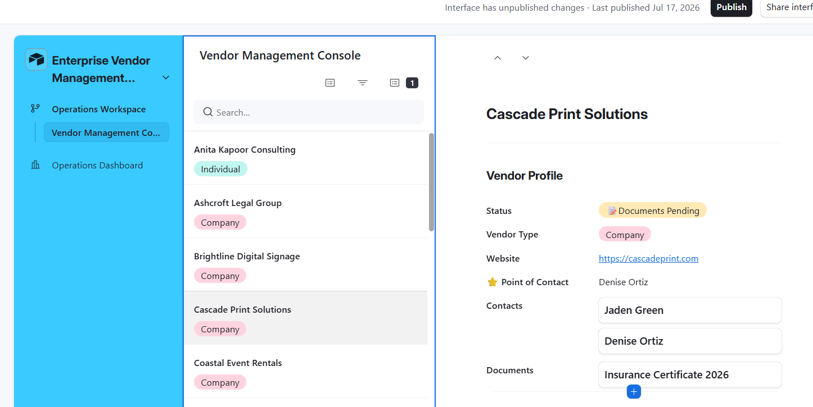
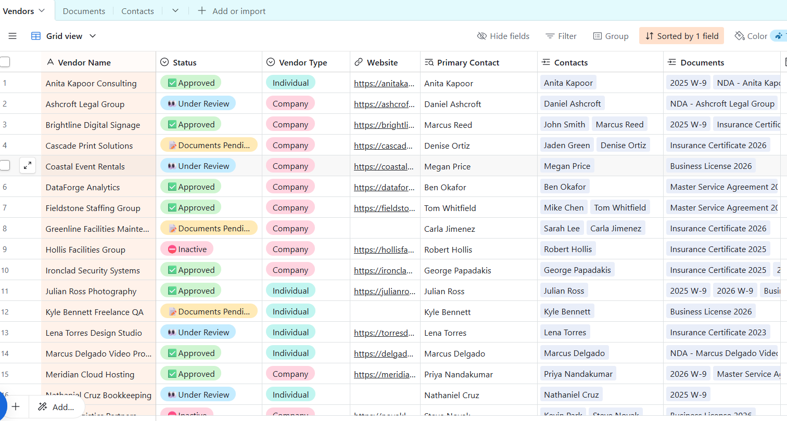
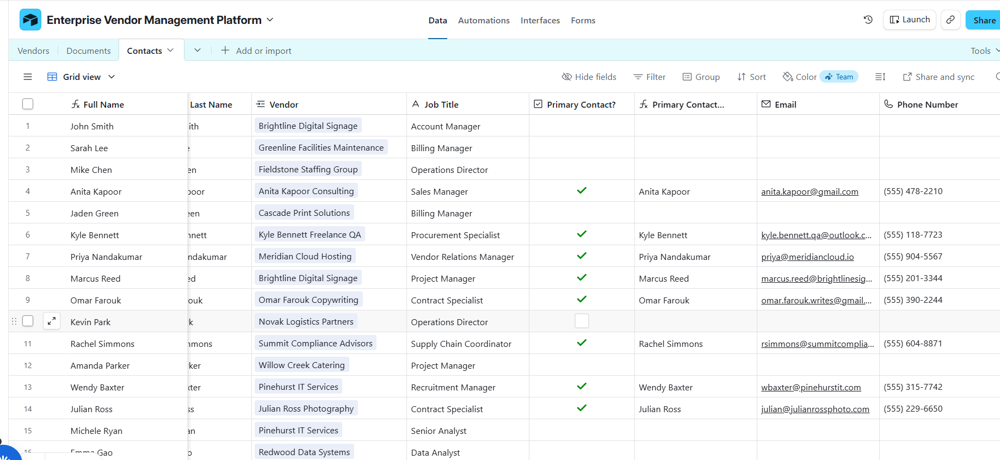
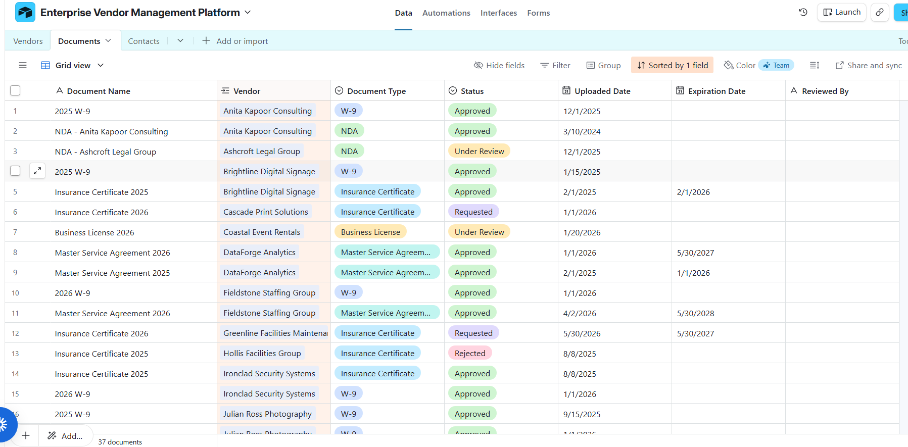

# Enterprise Vendor Management Platform

> A scalable vendor management solution built in Airtable to centralize vendor onboarding, document compliance, contact management, and operational reporting.

---

## Overview

Organizations often manage vendor information across spreadsheets, emails, and disconnected systems. This makes it difficult to track compliance documents, identify the correct point of contact, and maintain visibility into vendor status.

This project demonstrates how Airtable can be used as an enterprise operations platform by combining relational database design, interactive interfaces, and reporting dashboards into a single workspace.

---

# Business Problem

Operations teams frequently face challenges such as:

- Vendor information stored across multiple systems
- Missing or expired compliance documents
- No centralized view of vendor status
- Difficulty identifying the correct vendor contact
- Manual reporting and follow-up

This solution provides a centralized platform for managing vendors throughout their lifecycle.

---

# Solution

The platform consists of three connected data models with interactive interfaces designed for operations teams.

```
Vendor
│
├── Contacts
│
├── Documents
│
└── Interfaces
     ├── Operations Dashboard
     └── Vendor Management Console
```

---

# Key Features

## Vendor Management

- Centralized vendor repository
- Vendor lifecycle tracking
- Vendor categorization
- Website management

## Contact Management

- Multiple contacts per vendor
- Designated Point of Contact (POC)
- Interactive contact records
- Drill-down navigation

## Document Management

- Vendor compliance documents
- Linked document records
- Document status tracking
- Document count rollups
- Missing document identification

## Operations Dashboard

Provides operational visibility through:

- Vendor KPIs
- Vendor Status Distribution
- Vendor Type Distribution
- Document Status Dashboard
- Action Required Dashboard

## Vendor Management Console

Operations users can:

- Review vendor profiles
- View the designated Point of Contact
- Access related contacts
- Open compliance documents
- Navigate linked records without leaving the interface

---

# Database Design

The application is built using a relational database model.

### Vendors

- Vendor Name
- Status
- Vendor Type
- Website
- Point of Contact
- Contacts
- Documents
- Document Count
- Document Status

### Contacts

- Full Name
- Vendor
- Job Title
- Point of Contact
- Email
- Phone Number

### Documents

- Document Name
- Vendor
- Document Type
- Status
- Uploaded Date
- Expiration Date
- Reviewed By

---

# Airtable Features Demonstrated

- Relational Database Design
- Linked Records
- Lookup Fields
- Rollup Fields
- Formula Fields
- Single Select Fields
- Interfaces
- Interactive Record Navigation
- Operational Dashboards

---

# Project Screenshots

## Vendor Management Console



---

## Operations Dashboard - KPIs


---

## Operations Dashboard - Action Required


---

## Operations Dashboard - Document Status


---

## Vendors Table



---

## Contacts Table



---

## Documents Table



---

# Key Design Decisions

### Relational Data Model

Instead of storing vendor information in a single table, Vendors, Contacts, and Documents are modeled as independent entities connected through linked records. This minimizes data duplication and allows each entity to maintain its own lifecycle.

### Point of Contact

Each vendor can have multiple associated contacts, while a designated Point of Contact is surfaced directly in the Vendor Profile to reduce navigation and improve operational efficiency.

### Document Compliance

Documents are stored as individual records rather than embedded within vendor records. This allows each document to maintain its own approval status, upload date, expiration date, and review process.

### Dashboard-Driven Operations

The Operations Dashboard highlights vendor health, compliance status, and outstanding work so users can quickly prioritize operational tasks.

---

# Vendor Lifecycle

```
🟡 Prospective
      ↓
📝 Documents Pending
      ↓
👀 Under Review
      ↓
🟢 Approved
      ↓
⛔ Inactive
```

---

# Future Enhancements

Version 2 will include:

- Vendor Intake Form
- Automated Vendor Onboarding
- Document Expiration Notifications
- Automated Status Updates
- Compliance Reminder Emails
- Approval Workflow
- Vendor Performance Scorecards
- Contract Renewal Tracking

---

# Skills Demonstrated

- Airtable Solution Architecture
- Relational Database Design
- Business Process Analysis
- Operations Workflow Design
- Dashboard Development
- Data Modeling
- Interface Design
- Business Reporting
- Process Automation (Roadmap)

---

# What This Project Demonstrates

This project showcases the design of an enterprise-style operational platform using Airtable. It demonstrates practical experience with relational database modeling, user-focused interface design, operational dashboards, and scalable data architecture for real-world business workflows.
